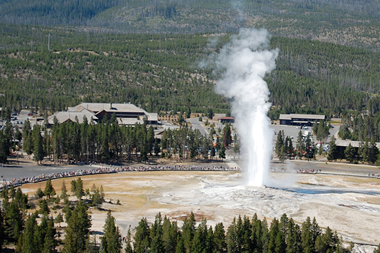

```{r setup, include=FALSE}
knitr::opts_chunk$set(echo = FALSE)
```


## Purpose
The goal of this project was to build a tool that could be used to predict how long Old Faithful was going to erupt based on the length of waiting time. 


<body style="background-color:darkblue;
			 color:white;
			 font-family:verdana">

<center>


<p> Figure 1: Old Faithful erupts in front of a throng of tourists </p>
</center>


##Old Faithful Geyser Data

Waiting time between eruptions and the duration of the eruption for the Old Faithful geyser in Yellowstone National Park, Wyoming, USA.

- 272 observations of waiting time(min) and eruption time(min)

<center>


<p> Figure 2: Old Faithful with the Milky Way overhead.
</center>


## Plot of Waiting Time Versus Eruption Time

As we can see below a linear model is a fairly accurate predictor of eruption time.

```{r plot_prep, include=FALSE}

library(plotly)
library(sjPlot)
fit <- lm(eruptions~ waiting, data=faithful)

```

<center>

```{r plot_old_lin}


faithful %>% plot_ly(x = ~waiting) %>% 
  add_markers(y = ~eruptions) %>% 
  add_lines(x = ~waiting, y = fitted(fit))
```

</center>


## Model Summary

The model summary output from can be seen below.

```{r tab_lin_reg}
tab_model(fit)
```


## Link to Shiny Application

<a href="https://dhaycraft.shinyapps.io/linear_reg_faithful/"; style="color:green">
Link to Application! </a>
